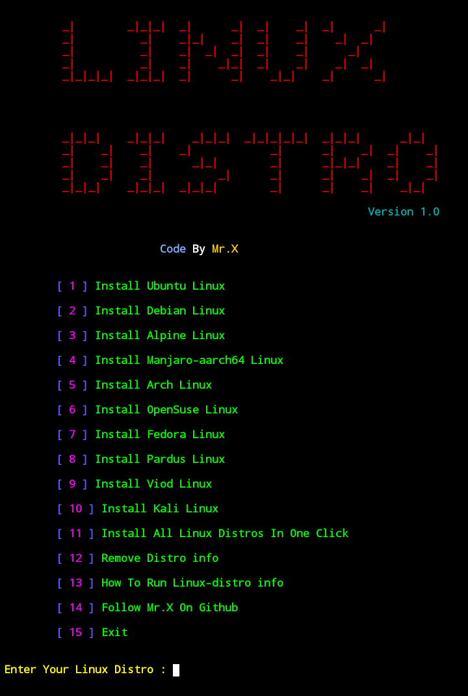

# Linux-distro




# This Tool Test On 👨‍💻
- only on Termux


# 🔰 Installation And Requirements 🔰


```bash
apt update && apt upgrade -y
```


```bash
apt install git -y
```


```bash
apt install proot-distro -y
```


```bash
git clone https://github.com/Whomrx666/Linux-distro.git
```


```bash
cd Linux-distro
```


```bash
chmod +x Linux-distro
```


```bash
./Linux-distro
```

### Original Author
<a href="https://github.com/Whomrx666"></a>

Follow me: [Whatsapp](https://wa.me/6287855190571),[Youtube](https://youtube.com/@whomrx666),[Tiktok](https://www.tiktok.com/@whomr.x),[Telegram](https://www.tiktok.com/@whomr.x),[Telegram](https://t.me/@Whomr_X),&[Website](https://whomrxhackers.blogspot.com/)

